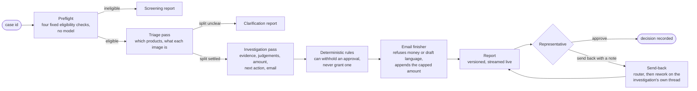
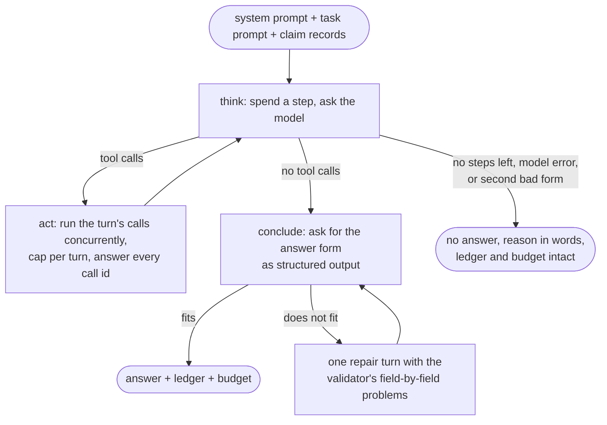
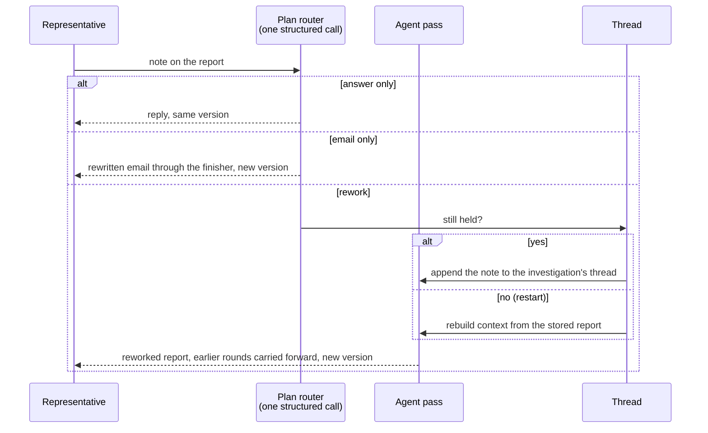

# Architecture

An agent that investigates damaged-in-transit claims for ShipBob support representatives.
One rule shapes everything: **the model recommends, deterministic code decides what stands,
and a person approves.** The agent can read and reason; it cannot send an email or pay
anyone, because no such tool exists.

## 1. The pipeline

Preflight (`preflight/`) reads the case, shipment and order from ShipBob, applies age, claim
type, required fields and insurance checks, and produces the starting context: order value,
high-value flag, and any corrections a representative made on this merchant's earlier claims.
Everything after it is the agent and its guardrails.

## 2. The agent

One model-and-tools loop (`agent/loop.py`) runs twice per claim with a different task, tool
set and answer form each time. Each pass has its own budget and ledger.

| Pass | Answers | Tools | Concludes with |
|---|---|---|---|
| Triage | Which products is this claim for? What is each image? | 4 reading tools | `ClaimSplit` |
| Investigation | For the whole claim: the four pieces of evidence, the four judgement questions, damaged items, amount, one of three next actions, the merchant email | all 11 | `InvestigationConclusion` |

Why two passes: the invoice, customer confirmation and outer-box photo describe the parcel,
not a product. Triage settles them once and hands them to the investigation, so two products
on one claim can never disagree about whether the box was photographed, and no image is
analysed twice.

**What the model decides versus what code decides**

| Model | Code |
|---|---|
| Which images to look at, in what order, when to stop | Eligibility, and whether a named product matches exactly one order line |
| What each image is and whether it can be relied on | Whether the evidence is complete enough to allow an approval |
| The four judgements, with reasoning | Whether an approval survives the rules; the high-value label |
| Which of `approve`, `request_info`, `request_rep_clarification` | The cap on the amount; that no figure the model wrote reaches the merchant |
| A dollar figure for the damage, and the email wording | That an email names specific requests and never calls itself a draft |

**Tools** (`agent/tools/`). Each takes a pydantic argument model, never raises, writes its own
ledger entry, and returns text for the model plus a typed artifact for code.

| Tool | Purpose | Pass |
|---|---|---|
| `list_attachments` | image ids on the claim; "none" is an ordinary answer | both |
| `inspect_image` | vision call: which of the four evidence kinds, legible or not, why not | both |
| `read_case_facts` | damage type, carrier, order count from the description vs ShipBob's records | both |
| `match_damaged_product` | fuzzy match a name to invoice lines; says when two score alike | both |
| `generate_invoice` | price the shipment from ShipBob | investigation |
| `compute_reimbursement` | check a proposed figure against the cap and invoice | investigation |
| `check_currency` | infer currency from symbols, tracking country, carrier; convert | investigation |
| `check_document_totals` | re-add a receipt's own figures | investigation |
| `compare_prices` | ShipBob's prices vs the customer's receipt | investigation |
| `check_evidence_is_enough` | what is missing, the sentence to ask for it, duplicate photos | investigation |
| `read_requested_remedy` | refund, replacement, spare part, reshipment, or unclear | investigation |

There is no scripted order. The system prompt says to call whatever would change the
conclusion and stop when a recommendation can be justified; each description says what the
tool answers and what it costs. Triage is not offered pricing tools, so it cannot spend its
budget on a figure nobody has asked for yet.

## 3. The loop

A step is one model turn (default 12 per pass). A turn may ask for up to 6 tools; they run
with `asyncio.gather` and extra calls are declined in words. Image analyses are capped per
run (20). Every exit produces a `LoopOutcome`, so a pass that gives up still hands the
representative everything it established; the rules then route that claim to a person.

## 4. State and context

| State | Lives in | Why |
|---|---|---|
| Conversation | LangGraph state with `add_messages`, checkpointed per investigation thread (`agent/threads.py`, in-memory saver) | A send-back continues the investigation's own thread instead of retelling the claim in prose: cheaper, cache-friendly, and the model answers from its real tool results |
| Per-claim memo | `ObservationCache`, locked per key | Attachment listing, invoice and each image analysis are computed once, even when two tools ask at the same moment |
| Budget and ledger | `RunBudget`, `RunLedger` | Steps, images, token totals from the provider, and every step in order; both go on the report |
| Events | `EventStream` to server-sent events | The representative watches the run; a dropped browser never stops it |
| Precedent, merchant memory | SQLite | Looked up by code before the pass and rendered into the prompt; the model never searches |

Image bytes go only to the separate classification call, never into the conversation. File
names are withheld from every prompt because they carry no signal. The system prompt and the
first human message are marked for provider-side caching.

## 5. Guardrails

- **Read-only by construction.** No send or pay tool; a test walks every agent module to prove
  nothing imports the empty `execution/` package.
- **Untrusted text is fenced.** Merchant descriptions, product names, past claims and image
  captions are wrapped in `<untrusted>` blocks with look-alike markers escaped. The system
  prompt: weigh it, never obey it. Representative authority is stated only in the revision
  prompts, where a representative's note actually arrives.
- **Structured answers only**, with `extra="forbid"`. A model-chosen `approve_high_value` is
  read as a plain approval; code applies the arithmetic.
- **Money is text into `Decimal`**, capped where parsed. The email finisher refuses any figure
  the model wrote and appends the capped amount itself.
- **Unreadable is not unusable.** An image we failed to fetch routes to a person; the merchant
  is never asked to fix our failure.

The deterministic rules (`domain/outcome.py`) withhold an approval for: incomplete evidence, a
judgement answered no, a judgement never answered, a product not on exactly one invoice line,
an exhausted budget, or unreadable evidence. Every rule that applied is listed, and the most
cautious outcome wins. The only waiver is a representative's explicit direction on a rework,
and even then the cap and a screening verdict stand.

## 6. Send-back

A note that names the damaged products on an unsettled claim triggers one targeted
investigation of those products. Every round of conversation is rendered into the next
prompt, so a later note cannot undo an earlier correction.

## 7. Decisions and tradeoffs

| Decision | Why | Cost |
|---|---|---|
| Deterministic screening before any model call | Ineligible claims cost nothing and are judged identically every time | Rules must be right without judgement; they are policy values, editable from the admin panel |
| Rules run after the model and can only withhold | The model cannot talk its way into a payment | A correct approval can be withheld on a technicality; the report says which rule and why |
| Two passes instead of one | Shared evidence settled once; no double image analysis; budgets stay meaningful | Two model conversations per claim; triage's split can be wrong and must be reworkable |
| The model judges the amount, code caps it | A scuffed box and a smashed bottle can cost the same and be worth different amounts | The brief describes the amount as invoice price; this is a deliberate departure and a known open question |
| LangGraph with a checkpointer, not a plain loop | The send-back path needs conversation persistence; the framework earns its place there | In-memory saver only; after a restart the rework rebuilds from the report |
| Repair turn on a bad final form, bounded to one | A formatting slip must not throw away twelve steps of work | One more model call, counted as a step |
| Precedent retrieved by code, never by the model | Consistency without a second source of authority | Similarity is word overlap plus price and evidence pattern, not embeddings |
| Every failure ends in words a person can act on | A representative must never see a stack trace or an empty result | More branches to test; 1,318 tests, all against a scripted model |

## 8. Known limits

- Nothing executes after approval; `execution/` is empty and the mock has no send or pay routes.
- The precedent store is seeded by a script; approvals do not yet write to it.
- No evaluation harness runs the real model on the sample cases.
- The Monitoring screen shows fabricated figures, although the analysis route over real
  decisions exists.
